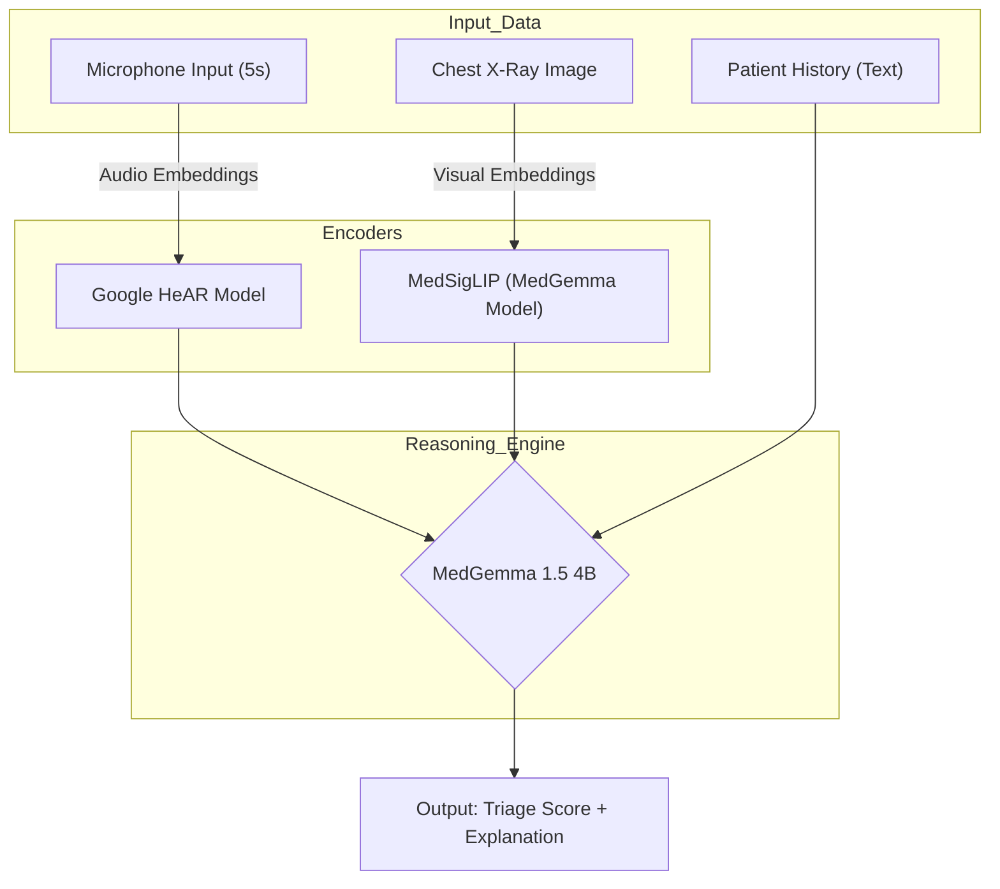

# Respi-View 360: Multimodal Triage for Respiratory Health 🫁 🎧

[](LICENSE)
[](https://www.python.org/)
[](https://sites.research.google/med-gemma/)
[]()
[](https://github.com/psf/black)

**Respi-View 360** is an open-source, privacy-first AI assistant designed to triage respiratory patients in resource-constrained environments. By fusing acoustic data (coughs/breathing) with visual data (Chest X-Rays), it provides a holistic clinical assessment on standard edge hardware.

> **⚠️ Disclaimer**: This tool is for research and demonstration purposes only. It is not intended to be a substitute for professional medical advice, diagnosis, or treatment.

---

## 🚨 The Challenge
Respiratory distress is a leading cause of emergency room visits globally. In crowded triage centers—especially in remote or understaffed areas—healthcare workers often lack the tools to rapidly differentiate between a common cold and critical failure.
* **Subjectivity:** Acoustic signs like "wheezing" or "crackles" are often missed or misclassified by tired ears.
* **Data Silos:** X-Rays and patient history are rarely analyzed in context with respiratory sounds instantly.
* **Connectivity:** Cloud-based AI tools fail in areas with poor internet access ("The Edge").

## 💡 The Solution
Respi-View 360 introduces a **Tri-Modal Architecture** that runs entirely offline.

1.  **👂 Audio Intelligence:** Uses **Google HeAR (Health Acoustic Representations)** to encode raw respiratory audio into clinically relevant embeddings (capturing micro-features at 100ms granularity).
2.  **👁️ Vision Intelligence:** Uses the **SigLIP** encoder to analyze Chest X-Rays (CXR) for opacities and structural anomalies.
3.  **🧠 Clinical Reasoning:** Fuses these streams into **MedGemma 1.5 (4B)**, a specialized multimodal LLM that generates a risk score and a natural language explanation.

---

## 🏗️ Technical Architecture


---
## 🚀 Features
* **Real-time Multimodal Analysis:** Correlates visual opacity with acoustic wheeze patterns.
* **Edge-Native:** Optimized to run on consumer GPUs (8GB VRAM) or high-end tablets using quantization.
* **Privacy-First:** No data leaves the device. All inference happens locally.
* **Explainable AI:** Does not just output a "score"—it explains *why* (e.g., *"High risk due to bilateral consolidation in CXR consistent with crackles detected in audio"*).

---

## 🛠️ Installation & Usage

### Prerequisites
* Python 3.10+
* GPU with min. 8GB VRAM (NVIDIA recommended for local inference)
* [Hugging Face Account](https://huggingface.co/) (to access MedGemma weights)

### 1. Clone the Repository
```bash
git clone https://github.com/lekhan-03/Respi-View-360.git
cd Respi-View-360
```
### 2. Install Dependencies
```bash
pip install -r requirements.txt
```
### 3. Run the Inference Notebook
Open Respi-View-360-Multimodal-Triage-for-Respiratory.ipynb to run the model interactively. (Note: You will need to accept the license agreement for MedGemma on Hugging Face before running).

## 🤝 Roadmap
* Core Multimodal Inference (Audio + Vision)

* 4-bit Quantization for Edge Devices

* Real-time Auscultation Support (Stethoscope input)

* Multi-language support for patient history

## 📄 License
This project is licensed under the Apache 2.0 License - see the LICENSE file for details.

## 🙏 Acknowledgements
* Google Research for the open-weights MedGemma and HeAR models.
* Hugging Face for the transformers library.


